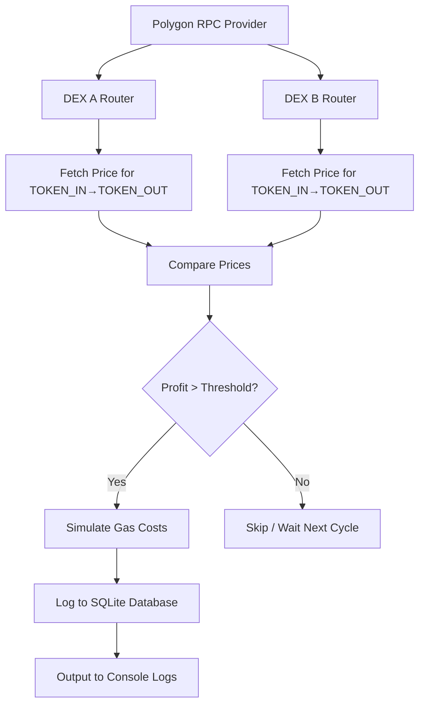

# Polygon Arbitrage Opportunity Detector Bot

A Rust-based bot that tracks arbitrage opportunities between two decentralized exchanges (DEXes) on the Polygon network. It monitors token pair price differences (e.g., WETH/USDC), simulates potential profit after gas fees, and stores profitable trades in a SQLite database.

---

## Features

- **Two-DEX Price Fetching** – Fetches live token pair prices (e.g., WETH/USDC) from **two Polygon DEXes** (QuickSwap and SushiSwap).  
- **Arbitrage Detection** – Identifies profitable arbitrage opportunities if the price difference exceeds a defined threshold.  
- **Simulated Profit Calculation** – Estimates profit in USDC after deducting simulated gas costs.  
- **Configuration Management** – Easily configure DEX router addresses, tokens, RPC URL, and thresholds using a `.env` file.  
- **Database Logging** – Stores detected opportunities in a structured SQLite database for future analysis.  
- **Robust & Modular** – Built with Rust’s safety, concurrency, and performance advantages.  

---

## Tech Stack

- **Language:** Rust  
- **Blockchain:** Polygon (via RPC)  
- **DEX Interaction:** Uniswap V2-style routers (QuickSwap, SushiSwap)  
- **Database:** SQLite (via rusqlite)  
- **Libraries:** ethers-rs, tokio, dotenv, serde, anyhow, log, env_logger  

---

## Project Structure

Polygon-Arbitrage-Opportunity-Detector-Bot/
│── src/
│ └── main.rs # Core bot logic
│── .env # Environment configuration
│── Cargo.toml # Dependencies & build config
│── arb_data.db # SQLite database (auto-created)
│── README.md # Project documentation

---

## Project Architecture / System Diagram

 **Explanation**

- Connect to Polygon RPC.

- Fetch current token prices from DEX A and DEX B.

- Compare the prices to check for profitable arbitrage.

- If profit exceeds threshold → simulate gas → log to SQLite database → output console logs.

- If not → skip and wait for the next polling cycle.

---

## Setup & Installation
1. Install Dependencies

Rust (version 1.70+ recommended)
Install via rustup:

curl --proto '=https' --tlsv1.2 -sSf https://sh.rustup.rs | sh

SQLite (used internally via rusqlite; usually no separate install needed)

Cargo crates (listed in Cargo.toml, installed automatically during build).

2. Configure .env

Create a .env file in the project root:

RPC_URL=https://polygon-mainnet.infura.io/v3/YOUR_KEY
DEX_A_ROUTER=0x1b02dA8Cb0d097eB8D57A175b88c7D8b47997506   # SushiSwap
DEX_B_ROUTER=0xa5E0829CaCEd8fFDD4De3c43696c57F7D7A678ff   # QuickSwap
TOKEN_IN=0x7ceB23fD6bC0adD59E62ac25578270cFf1b9f619       # WETH
TOKEN_OUT=0x2791Bca1f2de4661ED88A30C99A7a9449Aa84174      # USDC
TRADE_SIZE_WEI=1000000000000000000   # 1 WETH
MIN_PROFIT_USDC=0.5
POLL_INTERVAL_SECS=15
SIMULATED_GAS_USDC=0.2
DATABASE_PATH=arb_data.db

3. Build & Run

- Build the project:

  **cargo build --release**

- Run the bot with logging enabled (Windows PowerShell):

  **$env:RUST_LOG="info"; cargo run --release**

**Example Output**
[2025-09-26T12:23:48Z INFO  polygon_arb_bot] Starting polygon-arb-bot with poll_interval=15s, min_profit=0.5 USDC
[2025-09-26T12:23:50Z INFO  polygon_arb_bot] Prices: A = 3823.3225 | B = 3868.7322
[2025-09-26T12:23:50Z INFO  polygon_arb_bot]  Arbitrage opportunity! BUY on A at 3823.3225, SELL on B at 3868.7322 → Profit: 45.2097 USDC
