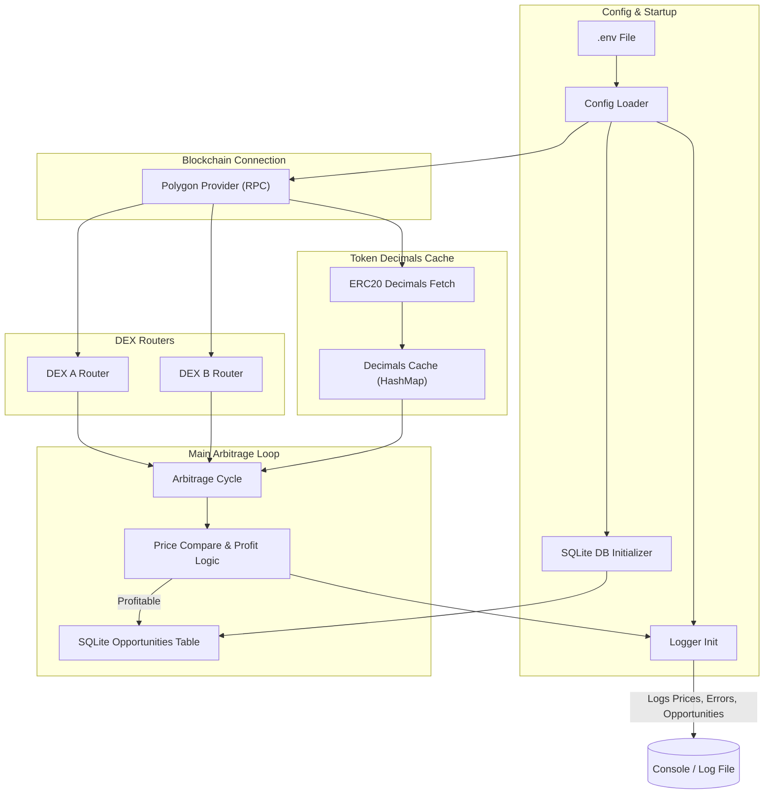

# Polygon Arbitrage Opportunity Detector Bot

A Rust-based bot that tracks arbitrage opportunities between two decentralized exchanges (DEXes) on the Polygon network. It monitors token pair price differences (e.g., WETH/USDC), simulates potential profit after gas fees, and stores profitable trades in a SQLite database.

---

## Features

- **Two-DEX Price Fetching** – Fetches live token pair prices (e.g., WETH/USDC) from **two Polygon DEXes** (QuickSwap and SushiSwap).  
- **Arbitrage Detection** – Identifies profitable arbitrage opportunities if the price difference exceeds a defined threshold.  
- **Simulated Profit Calculation** – Estimates profit in USDC after deducting simulated gas costs.  
- **Configuration Management** – Easily configure DEX router addresses, tokens, RPC URL, and thresholds using a `.env` file.  
- **Database Logging** – Stores detected opportunities in a structured SQLite database for future analysis.  
- **Robust & Modular** – Built with Rust’s safety, concurrency, and performance advantages.  

---

## Tech Stack

- **Language:** Rust  
- **Blockchain:** Polygon (via RPC)  
- **DEX Interaction:** Uniswap V2-style routers (QuickSwap, SushiSwap)  
- **Database:** SQLite (via rusqlite)  
- **Libraries:** ethers-rs, tokio, dotenv, serde, anyhow, log, env_logger  

---

## Project Structure

```plaintext
Polygon Arbitrage Opportunity Detector Bot/
│── src/
│   ├── main.rs       
│   └── uniswap.rs   
│
│── .env             
│── .gitignore       
│── Cargo.toml      
│── README.md         # Project documentation
```

---

##  System Architecture




 **Explanation**

- Loads config, logger, and database on startup.

- Connects to Polygon blockchain via RPC.

- Uses DEX routers to get token prices.

- Caches token decimals to reduce RPC calls.

- Runs an arbitrage loop to compare prices and find profit.

- Logs results and saves profitable trades in the database.

---

## Setup Instructions

## 1. Clone the repository

git clone https://github.com/Gourav2004/Polygon-Arbitrage-Opportunity-Detector-Bot.git

cd polygon-arb-bot


## 2. Create .env file

Create a .env file in the project root:

RPC_URL=YOUR_RPC_URL_HERE

DEX_A_ROUTER=DEX_A_ROUTER_ADDRESS

DEX_B_ROUTER=DEX_B_ROUTER_ADDRESS

TOKEN_IN=TOKEN_IN_ADDRESS

TOKEN_OUT=TOKEN_OUT_ADDRESS

TRADE_SIZE_WEI=TRADE_SIZE

MIN_PROFIT_USDC=0.5

POLL_INTERVAL_SECS=15

SIMULATED_GAS_USDC=0.2

DATABASE_PATH=arb_data.db


**Important: Replace YOUR_KEY and addresses with your own values.**

**Never commit your real .env file to GitHub. Make sure it’s included in .gitignore.**


## 3. Build the project

cargo build --release


## 4 Run the Bot

cargo run --release

**$env:RUST_LOG="info"; cargo run --release**

## Example Output

[2025-09-27T05:04:46Z INFO  polygon_arb_bot] Starting Polygon Arb Bot | Poll every 15s | Min profit 0.5 USDC

[2025-09-27T05:04:48Z INFO  polygon_arb_bot] Prices: A = 3950.5280 | B = 3998.5273

[2025-09-27T05:04:48Z INFO  polygon_arb_bot]  Arb Opportunity: Buy on DEX A @ 3950.5280, Sell on DEX B @ 3998.5273 → Profit: 47.7993 USDC


